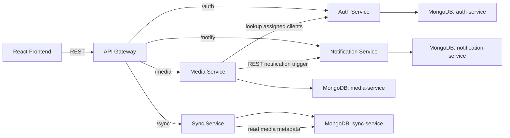

# Villa Media Sync Platform

## Overview
Villa Media Sync Platform is a small full-stack microservices app for:

- registering `CLIENT` and `SALES_AGENT` users
- assigning clients to villas
- uploading and versioning villa media
- simulating WiFi-triggered sync
- notifying clients when villas are assigned or new media is uploaded

The project contains:

- a React frontend
- an API gateway
- separate auth, media, sync, and notification services
- MongoDB-backed persistence for each service

## Current Behavior

### Roles
- `CLIENT`
  - registers with email and password only
  - cannot upload media
  - can only see media and sync data for their assigned villa
  - must be assigned a villa later by a sales agent
- `SALES_AGENT`
  - can register and log in
  - can upload media for any villa
  - can assign villas to clients
  - can see all villas
  - can delete villas

### Frontend Pages
- `Login`
- `Register`
- `Dashboard`
- `Client Assignments` for sales agents
- `All Villas` for sales agents
- `Media Library`
- `Notifications`
- `Sync`

### Media Features
- file upload for sales agents only
- media versioning by `villaId + fileName`
- duplicate upload prevention by file hash within the same villa
- duplicate download prevention per user and file
- media access activity logging for view and download events

### Notifications
Clients receive notifications when:

- a villa is assigned to them
- their villa assignment is removed
- new media is uploaded for their assigned villa

## Architecture
- **Frontend (React):** calls the API Gateway with REST
- **API Gateway:** proxies requests to internal services
- **Auth Service:** registration, login, user profile, client assignment
- **Media Service:** upload, listing, downloads, access logs, villa summaries
- **Sync Service:** WiFi sync simulation and version comparison
- **Notification Service:** stores and returns notifications

### Communication
- **REST:** frontend -> API Gateway -> services
- **Service-to-service REST:** media/auth/sync/notification interactions
- **Simulated event flow:** notification triggers are implemented with internal REST calls

## System Diagram


## Tech Stack
- Node.js
- Express
- MongoDB + Mongoose
- React
- Vite
- JWT authentication

## Project Structure
```text
frontend/
services/
  api-gateway/
  auth-service/
  media-service/
  notification-service/
  sync-service/
README.md
```

## Setup

### Prerequisites
- Node.js and npm
- MongoDB running locally or a MongoDB Atlas connection string

### MongoDB
The services are designed to use separate databases. Local examples:

```env
mongodb://127.0.0.1:27017/auth-service
mongodb://127.0.0.1:27017/media-service
mongodb://127.0.0.1:27017/notification-service
mongodb://127.0.0.1:27017/sync-service
```

### Environment Files
Create these files if they do not already exist:

- `services/api-gateway/.env`
- `services/auth-service/.env`
- `services/media-service/.env`
- `services/notification-service/.env`
- `services/sync-service/.env`
- `frontend/.env`

### Important Environment Notes
- Use the same `JWT_SECRET` in:
  - `services/api-gateway/.env`
  - `services/auth-service/.env`
  - `services/media-service/.env`
  - `services/notification-service/.env`
- Use that same secret value as `SYNC_SERVICE_JWT_SECRET` in:
  - `services/sync-service/.env`
- Each service should use its own `MONGODB_URI`
- The frontend should point to the API gateway base URL

### Example Service Environment Values

#### `services/auth-service/.env`
```env
PORT=4001
MONGODB_URI=mongodb://127.0.0.1:27017/auth-service
JWT_SECRET=replace_this_secret
NOTIFICATION_SERVICE_URL=http://127.0.0.1:4003
```

#### `services/media-service/.env`
```env
PORT=4002
MONGODB_URI=mongodb://127.0.0.1:27017/media-service
JWT_SECRET=replace_this_secret
AUTH_SERVICE_URL=http://127.0.0.1:4001
NOTIFICATION_SERVICE_URL=http://127.0.0.1:4003
UPLOAD_DIR=uploads
MAX_FILE_SIZE_MB=50
```

#### `services/notification-service/.env`
```env
PORT=4003
MONGODB_URI=mongodb://127.0.0.1:27017/notification-service
JWT_SECRET=replace_this_secret
```

#### `services/sync-service/.env`
```env
PORT=4004
MONGODB_URI=mongodb://127.0.0.1:27017/sync-service
SYNC_SERVICE_JWT_SECRET=replace_this_secret
MEDIA_SERVICE_URL=http://127.0.0.1:4002
NOTIFICATION_SERVICE_URL=http://127.0.0.1:4003
```

#### `services/api-gateway/.env`
```env
PORT=4000
JWT_SECRET=replace_this_secret
AUTH_SERVICE_URL=http://127.0.0.1:4001
MEDIA_SERVICE_URL=http://127.0.0.1:4002
NOTIFICATION_SERVICE_URL=http://127.0.0.1:4003
SYNC_SERVICE_URL=http://127.0.0.1:4004
```

#### `frontend/.env`
```env
VITE_API_BASE_URL=http://127.0.0.1:4000
```

## Install Dependencies
Run `npm install` in each folder:

```powershell
cd services/api-gateway
npm install

cd ../auth-service
npm install

cd ../media-service
npm install

cd ../notification-service
npm install

cd ../sync-service
npm install

cd ../../frontend
npm install
```

## Run the App
Open separate terminals and start:

```powershell
cd services/api-gateway
npm run dev
```

```powershell
cd services/auth-service
npm run dev
```

```powershell
cd services/media-service
npm run dev
```

```powershell
cd services/notification-service
npm run dev
```

```powershell
cd services/sync-service
npm run dev
```

```powershell
cd frontend
npm run dev
```

Then open the frontend in your browser, typically at:

- `http://127.0.0.1:5173`

## Main User Flows

### Register a Client
1. Open `Register`
2. Select `Client`
3. Enter email and password
4. Log in
5. A sales agent later assigns the villa

### Register a Sales Agent
1. Open `Register`
2. Select `Sales Agent`
3. Enter email and password
4. Log in

### Assign a Villa to a Client
1. Log in as sales agent
2. Open `Client Assignments`
3. Choose a client
4. Set a `villaId`

### Upload Media
1. Log in as sales agent
2. Open `Media Library`
3. Enter a villa ID
4. Upload one or more files

### Sync Media
1. Open `Sync`
2. As a client, the assigned villa is used automatically
3. As a sales agent, enter the villa ID manually
4. Optionally paste device version JSON
5. Trigger WiFi sync
6. Download any returned updates

Sync downloads follow the same duplicate-download rule as the Media Library:

- each user can download a given media file once
- files already downloaded by that user are shown as already downloaded in the UI

### View All Villas
1. Log in as sales agent
2. Open `All Villas`
3. Review villa summaries
4. Optionally delete a villa

## API Overview
These routes are exposed through the API Gateway.

### Auth
- `POST /auth/register`
- `POST /auth/login`
- `GET /auth/me`
- `GET /auth/clients`
- `PATCH /auth/clients/:id/villa`
- `GET /auth/clients/by-villa/:villaId`
- `GET /auth/client-villas`
- `DELETE /auth/client-villas/:villaId`

### Media
- `POST /media/upload`
- `GET /media/villas`
- `DELETE /media/villas/:villaId`
- `GET /media/activity/:villaId`
- `GET /media/:villaId`
- `GET /media/file/:id`

### Sync
- `POST /sync`

### Notifications
- `POST /notify`
- `GET /notify/mine`

### Health
- `GET /health`
- `GET /ready`

## Role-Based Access Rules
- Clients can only access media and sync data for their assigned villa
- Sales agents can access all villas
- Clients cannot upload media
- Sales agents can upload media and manage villa assignments

## Villa Deletion
Deleting a villa from the sales agent `All Villas` page will:

- remove media records for that villa
- delete uploaded media files from storage
- remove related media access log entries
- clear that villa assignment from any clients

## Scalability Notes
- Services are stateless and can scale horizontally
- JWT auth avoids in-memory session state
- MongoDB is separated by service boundary
- Media storage is local in this project, but should move to shared storage or object storage in production

## Security Notes
- JWT-based protected routes
- role-based access control in auth, media, and sync flows
- basic request rate limiting
- duplicate download protection
- server-side validation for main request fields

## Known Notes
- Service-to-service events are simulated with REST calls, not a message broker
- Media files are stored on local disk in the media service
- Clients need to log in again after villa assignment changes if an old token/session is still cached
